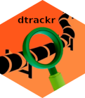
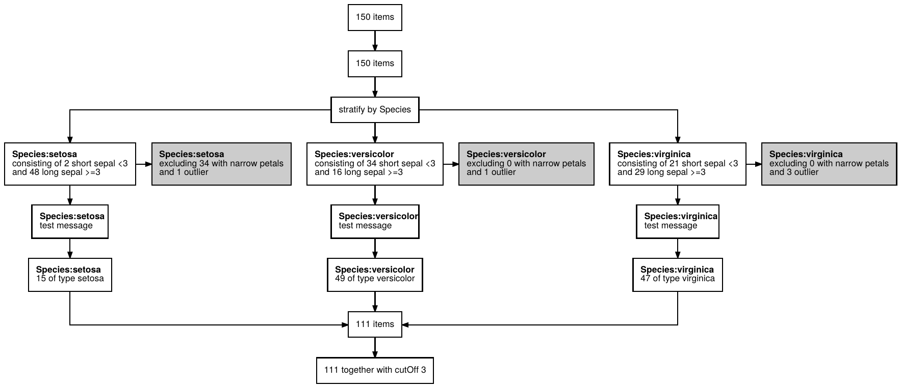

# dtrackr: Track your Data Pipelines <a href='https://terminological.github.io/dtrackr/index.html'></a>

<!-- badges: start -->

[](https://github.com/terminological/dtrackr/actions)
[](https://zenodo.org/badge/latestdoi/335974323)
[](https://terminological.r-universe.dev)
[](https://cran.r-project.org/package=dtrackr)
[](https://cran.r-project.org/package=dtrackr)
[](https://app.codecov.io/gh/terminological/dtrackr)
[](https://doi.org/10.21105/joss.04707)
[](https://gtr.ukri.org/projects?ref=EP%2FY028392%2F1)

<!-- badges: end -->

## Overview

Accurate documentation of a data pipeline is a first step to
reproducibility, and a flow chart describing the steps taken to prepare
data is a useful part of this documentation. In analyses that rely on
data that is frequently updated, documenting a data flow by copying and
pasting row counts into flowcharts in PowerPoint becomes quickly
tedious. With interactive data analysis, and particularly using
RMarkdown, code execution sometimes happens in a non-linear fashion, and
this can lead to, at best, confusion and at worst erroneous analysis.
Basing such documentation on what the code does when executed
sequentially can be inaccurate when the data has being analysed
interactively.

The goal of `dtrackr` is to take away this pain by instrumenting and
monitoring a dataframe through a `dplyr` pipeline, creating a
step-by-step summary of the important parts of the wrangling as it
actually happened to the dataframe, right into dataframe metadata
itself. This metadata can be used to generate documentation as a
flowchart, and allows both a quick overview of the data and also a
visual check of the actual data processing.

## Installation

In general use `dtrackr` is expected to be installed alongside the
`tidyverse` set of packages. It is recommended to install `tidyverse`
first.

Binary packages of `dtrackr` are available on CRAN and r-universe for
`macOS` and `Windows`. `dtrackr` can be installed from source on Linux.
`dtrackr` has been tested on R versions 3.6, 4.0, 4.1 and 4.2.

You can install the released version of `dtrackr` from
[CRAN](https://CRAN.R-project.org) with:

``` r
install.packages("dtrackr")
```

### System dependencies for installation from source

For installation from source on Linux, `dtrackr` has required transitive
dependencies on a few system libraries. These can be installed with the
following commands:

``` bash
# Ubuntu 20.04 and other debian based distributions:
sudo apt-get install libcurl4-openssl-dev libssl-dev librsvg2-dev \
  libicu-dev libnode-dev libpng-dev libjpeg-dev libpoppler-cpp-dev

# Centos 8
sudo dnf install libcurl-devel openssl-devel librsvg2-devel \
  libicu-devel libpng-devel libjpeg-turbo-devel poppler-devel

# for other linux distributions I suggest using the R pak library:
# install.packages("pak")
# pak::pkg_system_requirements("dtrackr")

# N.B. There are additional suggested R package dependencies on 
# the `tidyverse` and `rstudioapi` packages which have a longer set of dependencies. 
# We suggest you install them individually first if required.
```

### Alternative versions of `dtrackr`

Early release versions are available on the `r-universe`. This will
typically be more up to date than CRAN.

``` r
# Enable repository from terminological
options(repos = c(
  terminological = 'https://terminological.r-universe.dev',
  CRAN = 'https://cloud.r-project.org'))
# Download and install dtrackr in R
install.packages('dtrackr')
```

The unstable development version is available from
[GitHub](https://github.com/) with:

``` r
# install.packages("devtools")
devtools::install_github("terminological/dtrackr")
```

## Example usage

Suppose we are constructing a data set with out initial input being the
`iris` data. Our analysis depends on some `cutOff` parameter and we want
to prepare a stratified data set that excludes flowers with narrow
petals, and those with the biggest petals of each Species. With
`dtrackr` we can mix regular `dplyr` commands with additional `dtrackr`
commands such as `comment` and `status`, and an enhanced implementation
of `dplyr::filter`, called `exclude_all`, and `include_any`.

``` r
# a pipeline parameter
cutOff = 3

# the pipeline
dataset = iris %>% 
  track() %>%
  status() %>%
  group_by(Species) %>%
  status(
    short = p_count_if(Sepal.Width<cutOff), 
    long= p_count_if(Sepal.Width>=cutOff), 
    .messages=c("consisting of {short} short sepal <{cutOff}","and {long} long sepal >={cutOff}")
  )  %>%
  exclude_all(
    Petal.Width<0.3 ~ "excluding {.excluded} with narrow petals",
    Petal.Width == max(Petal.Width) ~ "and {.excluded} outlier"
  ) %>%
  comment("test message") %>%
  status(.messages = "{.count} of type {Species}") %>%
  ungroup() %>%
  status(.messages = "{.count} together with cutOff {cutOff}") 
```

Having prepared our dataset we conduct our analysis, and want to write
it up and prepare it for submission. As a key part of documenting the
data pipeline a visual summary is useful, and for bio-medical journals
or clinical trials often a requirement.

``` r
dataset %>% flowchart()
```



And your publication ready data pipeline, with any assumptions you care
to document, is creates in a format of your choice (as long as that
choice is one of `pdf`, `png`, `svg` or `ps`), ready for submission to
Nature.

This is a trivial example, but the more complex the pipeline, the bigger
benefit you will get.

Check out the [main documentation for more
details](https://terminological.github.io/dtrackr/), and in particular
the [getting started
vignette](https://terminological.github.io/dtrackr/articles/dtrackr.html).

## Funding

The authors gratefully acknowledge the support of the UK Research and
Innovation AI programme of the Engineering and Physical Sciences
Research Council [EPSRC grant
EP/Y028392/1](https://gtr.ukri.org/projects?ref=EP%2FY028392%2F1).
