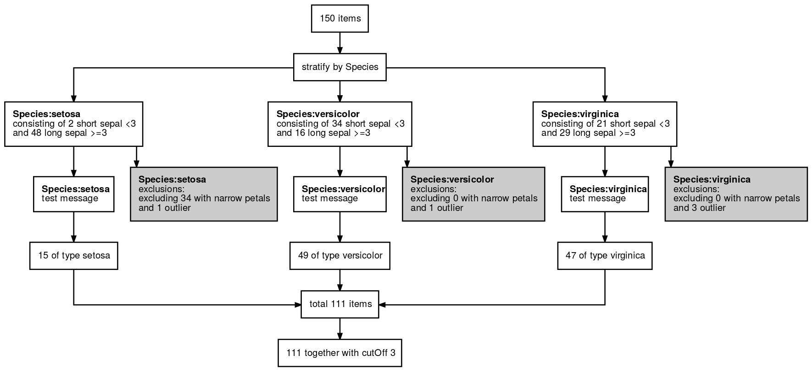

<!-- README.md is generated from README.Rmd. Please edit that file -->

# dtrackr

<!-- badges: start -->

[](https://travis-ci.com/terminological/dtrackr)
[](https://www.tidyverse.org/lifecycle/#experimental)
<!-- [](https://cran.r-project.org/package=dtrackr) -->
<!-- badges: end -->

I have been known to execute parts of my data pipeline more than once.
Sometimes part of my pipeline is designed to change depending on a
specific parameter, for example an age cutoff, which I tweak and re-run.
With interactive data analysis, and particularly using RMarkdown, this
sometimes happens in a non-linear fashion, leading to, at best,
confusion and at worst erroneous analysis.

Accurate documentation of a data pipeline is a first step to
reproducibility, but in parameterised analysis that relies on data that
is frequently updated, copying and pasting row counts into flowcharts in
PowerPoint becomes quickly tedious. In the past I’ve based such flow
charts on what I think my code is doing rather than actually what it
did, which can lead to potential embarrassment.

The goal of `dtrackr` is to take away this pain by instrumenting and
monitoring a dataframe through a `dplyr` pipeline, creating a
step-by-step summary of the important parts of the wrangling that
actually happened to the dataframe, right into dataframe metadata
itself.

This way the pipeline documents itself, errors are easier to spot, there
is less risk of error, and we have more time to spend with our
kids/dog/playstation. What’s not to like?

## Installation

dtrackr is in early development. It is not yet available on CRAN.

<!-- You can install the released version of dtrackr from [CRAN](https://CRAN.R-project.org) with: -->

<!-- ``` r -->

<!-- install.packages("dtrackr") -->

<!-- ``` -->

The development version is available from [GitHub](https://github.com/)
with:

``` r
# install.packages("devtools")
devtools::install_github("terminological/dtrackr")
```

## Example

Suppose we are constructing a data set with out initial input being the
`iris` data. Our analysis depends on some `cutOff` parameter and we want
to prepare a stratified data set that excludes flowers with narrow
petals, and those with the biggest petals of each Species. With
`dtrackr` we can mix regular `dplyr` commands with additional `dtrackr`
commands such as `comment` and `status`, and an enhanced implementation
of `dplyr::filter`, called `exclude_all`, and `include_any`.

``` r
# a pipeline parameter
cutOff = 3

# the pipeline
dataset = iris %>% 
  track() %>%
  status() %>%
  group_by(Species) %>%
  status(
    short = p_count_if(Sepal.Width<cutOff), 
    long= p_count_if(Sepal.Width>=cutOff), 
    .messages=c("consisting of {short} short sepal <{cutOff}","and {long} long sepal >={cutOff}")
  )  %>%
  exclude_all(
    Petal.Width<0.3 ~ "excluding {.excluded} with narrow petals",
    Petal.Width == max(Petal.Width) ~ "and {.excluded} outlier"
  ) %>%
  comment("test message") %>%
  status(.messages = "{.count} of type {Species}") %>%
  ungroup() %>%
  status(.messages = "{.count} together with cutOff {cutOff}") 
```

Having prepared our dataset we conduct our analysis, fit our models,
massage our statistics, and disprove our hypothesis, write it up and
prepare it for submission.

It is usually at this point someone says, “Did you exclude XYZ?” or “How
many of WXY did you find in each group?” or something similar. Before
dtrackr you would have muttered something about having to look at the
code to see what you did (and hope it does the same thing next time),
but now all you do is this:

``` r

# man/figures path needed here to ensure this works for pkgdown and for github
dataset %>% flowchart("man/figures/demo")
```



And your publication ready data pipeline, with any assumptions you care
to document, is creates in a format of your choice (as long as that
choice is one of pdf, png, svg or ps), ready for submission to Nature.

This is a trivial example, but the more complex the pipeline, the bigger
benefit you will get.
